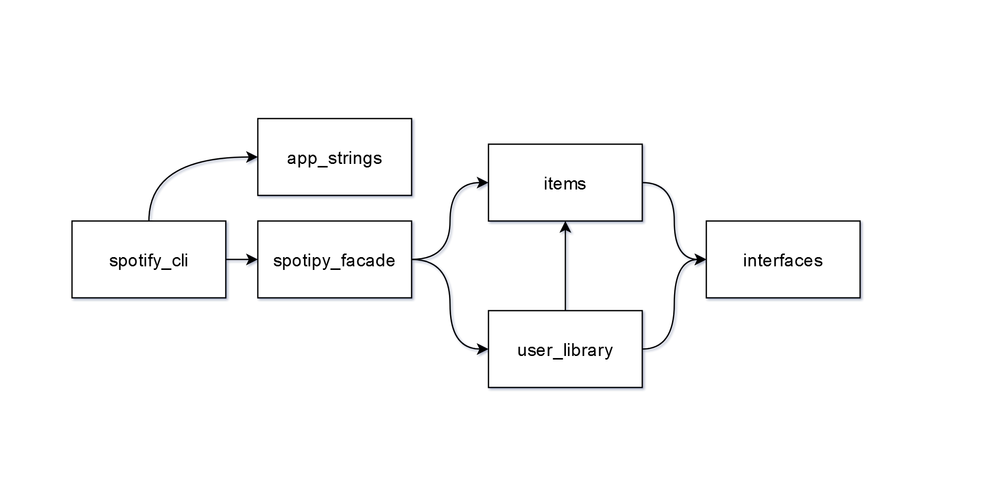

# spotify-py-cli

A command line application, written in Python, for interacting with Spotify. 

The primary purpose behind developing this app was to gain experience in using Test Driven Development, and to familiarize myself with the spotify API.

**NOTE:** This app is still a work in progress and as such, some of the info in this doc may be subject to change.

## How To Use
First, follow the steps in [Setup](#setup).

Once you have an executable, or you've downloaded the source, and have a terminal open, run it!
With Python:
> python spotify-cli.py 

Using exe with Windows:
> .\spotify-cli 

Linux:
> ./spotify-cli 

Running it without any arguments will in typical command line fashion show usage help. Run any command without args to get specfic help for any given command.

## Supported Functionality
Currently with this cli you can do the following:
* Create new playlists
    * You can set the name, description, public status, and collaborative status
* Edit any existing playlists you own, or are a collaborator on 
* Add and remove items from your user library
    * This includes followable items like artists and playlists, as well as savable items like albums, tracks, episodes and shows
    * Currently following, unfollowing, saving, and unsaving are all seperate commands
* Show (list) items currently in your user library 
    * Supports all followable/savable items

## Future Functionality 
### Here are features that I want to add in the very close, to near future:
The biggest one in mind is playback support. I may add other smaller things, but this is the primary thing I don't have yet that I want to add. Here's a more detailed list of what I'm looking to add:
* Playback support
    * Be able to play and pause playback of the current track
    * 'play' command will also accept a track id so you can start playback of a new track
    * Be able skip to next track
    * Be able to toggle shuffle on and off
    * Seek position in a track 
    * Set volume
    * Add an item to the playback queue (passing multiple track ids to 'play' will also do this)

## Design

This a very brief overview of my program design, bug me if you want me to expand this. I'll probably expand it at some point in the future.

Broadly speaking, the cli `spotify-cli.py` depends only on one thing, a facade. The facade `spotipy_facade.py` is a wrapper I wrote around `spotipy` which is itself a wrapper written around the Spotify API. _See Figure 1.1 for a visual layout of the modules_.

I wrote the facade to further simplify interaction (and seperate my cli app from) the wrapper. 

The facade itself is comprised of three modules: `spotify_facade.py`, the main file, `items.py`, and `user_library.py`. 

`items.py`, and `user_library.py` both contain item types which the facade works with, and returns to the cli based on what commands are being run. The types in those two files are the basis for all interaction with the api.

The types defined in `items.py`, and `user_library.py` implement interfaces as defined in `interfaces.py`. 

**Figure 1.1**


## Setup 

First, you must get authorization.

For simplicity, and because Spotipy doesn't support Implicit Grant authorization, to use this cli, you must register an app using the [Spotify Developer Dashboard](https://developer.spotify.com/dashboard/applications) so that the app can use Authorization Code flow:
1. Log in 
2. Click the **CREATE AN APP** button in the top right corner 
3. Once you have created your app, on the app overview page, click **EDIT SETTINGS**
4. Set the Redirect URI to http://localhost:8080 (You can change this to something else like: http://example.com, or http://127.0.0.1:9090, but it has to be the same in the app settings page and in the .env file)
5. Note that the Client ID and Client Secret are also on the app overview page; these will be used later

Next, you have two options: Use a standalone release, or use Python.
### Using a Standalone Release: COMING SOON
**Note**: I haven't made any standalone releases yet. If you really want one, open an issue to bug me about it.

Or, you can use [pyinstaller](https://www.pyinstaller.org/) to build a standalone app yourself; it's what I'll be doing when I get around to it.

If you don't want to install Python onto your system, you can download an existing standalone build of the app from the releases page.
1. Download the latest release from the [releases page](TODO_Insert_LINK)
2. See step 3 of **Using Python**
### Using Python
1. Clone the repo 
2. Install Python 3.8 or greater 
    * Note: This app was built using Python 3.8 and 3.96, but it may work with older versions; I have not tested anything older than 3.8 so I can't make any guarentees for anything older than that.
3. Create a credentials file 
    1. Retrieve your Client ID and Client Secret from the app overview page
    2. Create .env file and place it into the same directory as the source code (or exe if using a standalone release)
    3. Place the following text into the .env file:
        ```
        SPOTIPY_CLIENT_ID=Your_Spotify_Client_ID
        SPOTIPY_CLIENT_SECRET=Your_Spotify_Client_Secret
        SPOTIPY_REDIRECT_URI=http://localhost:8080
        ``` 
4. If Python is in the path, then navigate to the directory the app is in and run the app with:
    > py spotify-cli.py 

## Credits
This project uses [Spotipy](https://spotipy.readthedocs.io/en/2.19.0/) for interacting with the Spotify API, 
and [Typer](https://typer.tiangolo.com/) for managing the CLI bits.
